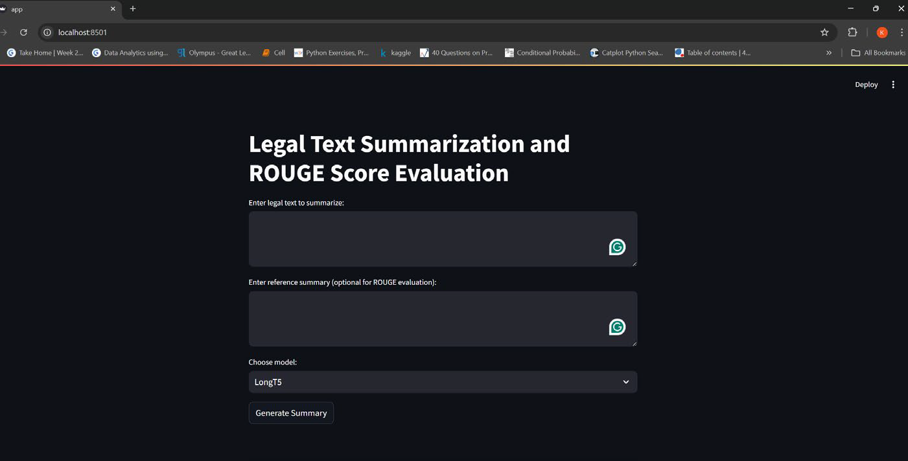

# Legal Text Summarization Application 
[](https://www.python.org/)
[](LICENSE)

A legal text summarization tool leveraging state-of-the-art transformer models (LongT5, GPT-2, Llama3) for automatic summarization and ROUGE score evaluation. This project demonstrates model fine-tuning, evaluation, and a Streamlit-based web interface for interactive summarization.

## Features

- Summarize legal documents using fine-tuned transformer models.
- Evaluate summaries with ROUGE metrics.
- Interactive web UI built with Streamlit.
- Easily switch between LongT5, GPT-2, and Llama3 models.

## Project Structure

```
.
├── app.py                   # Streamlit web app for summarization and evaluation
├── model_finetuning.ipynb   # Jupyter notebook for model training and evaluation
├── requirements.txt         # Python dependencies
├── .env                     # Environment variables for model paths (should be in .gitignore)
├── .gitignore               # Git ignore file
└── .gitattributes
```

## Installation

1. **Clone this repository:**
    ```sh
    git clone https://github.com/<your-username>/LegalDocs_Summarizer.git
    cd LegalDocs_Summarizer
    ```

2. **Install dependencies:**
    ```sh
    pip install -r requirements.txt
    ```
    Or, install manually:
    ```sh
    pip install transformers datasets torch rouge-score streamlit evaluate matplotlib tqdm
    ```
    If you use Google Colab or Hugging Face Hub features, you may also want:
    ```
    huggingface_hub>=0.15.0
    ```

## Setup

1. **Download or fine-tune models:**
    - See [`model_finetuning.ipynb`](model_finetuning.ipynb) for instructions on fine-tuning and saving models.

2. **Set model paths in `.env`:**
    - Create a `.env` file in the project root (if not present).
    - Add the following lines, updating the paths to where your fine-tuned models are stored:
      ```
      LONGT5_MODEL_PATH=path/to/your/fine_tuned_long_t5_model
      GPT2_MODEL_PATH=path/to/your/fine_tuned_gpt2_model
      LLAMA_MODEL_PATH=path/to/your/fine_tuned_llama3_model
      ```
    - Example for Windows:
      ```
      LONGT5_MODEL_PATH=C:\Users\yourname\models\fine_tuned_long_t5_model
      GPT2_MODEL_PATH=C:\Users\yourname\models\fine_tuned_gpt2_model
      LLAMA_MODEL_PATH=C:\Users\yourname\models\fine_tuned_llama3_model
      ```
    - The app will automatically read these paths using `python-dotenv` and `os.getenv()` in [`app.py`](app.py) as needed.
    
### Hugging Face Token Setup

Some models (such as Llama-3) require authentication with a Hugging Face token to download or use.  
Follow these steps:

1. **Get your Hugging Face token:**
    - Go to [https://huggingface.co/settings/tokens](https://huggingface.co/settings/tokens)
    - Click "New token", give it a name, and copy the generated token.

2. **Login with your token (choose one method):**

    - **Command line (recommended):**
        ```sh
        huggingface-cli login
        ```
        Paste your token when prompted.

    - **Set as environment variable (for scripts/Streamlit):**
        ```sh
        set HF_TOKEN=your_token_here  # Windows
        export HF_TOKEN=your_token_here  # Linux/macOS
        ```

    - **Directly in code (not recommended for production):**
        ```python
        from huggingface_hub import login
        login("your_token_here")
        ```

3. **Restart your terminal or kernel if needed.**

Now you can download and use gated models from Hugging Face in your notebook or app.

## How to Run

1. **Start the Streamlit app:**
    ```sh
    streamlit run app.py
    ```

2. **Usage:**
    - Enter legal text in the input box.
    - (Optional) Provide a reference summary for ROUGE evaluation.
    - Select the model and click "Generate Summary".
    - View the generated summary and ROUGE scores.


## Model Training

- The notebook [`model_finetuning.ipynb`](model_finetuning.ipynb) demonstrates:
    - Loading and preprocessing the dataset.
    - Fine-tuning LongT5, GPT-2, and Llama3 models.
    - Evaluating with ROUGE metrics.
    - Saving the fine-tuned models for later use.

## References

- [Hugging Face Transformers - Summarization](https://huggingface.co/docs/transformers/en/tasks/summarization)

---

## License

MIT License